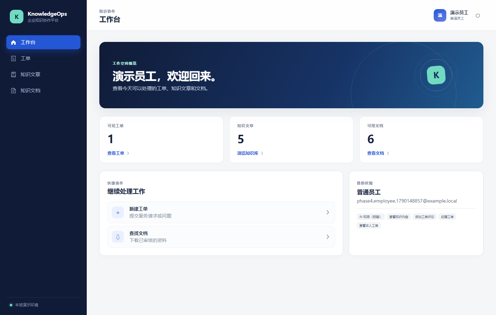
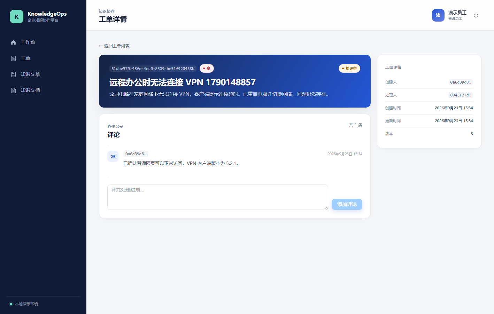
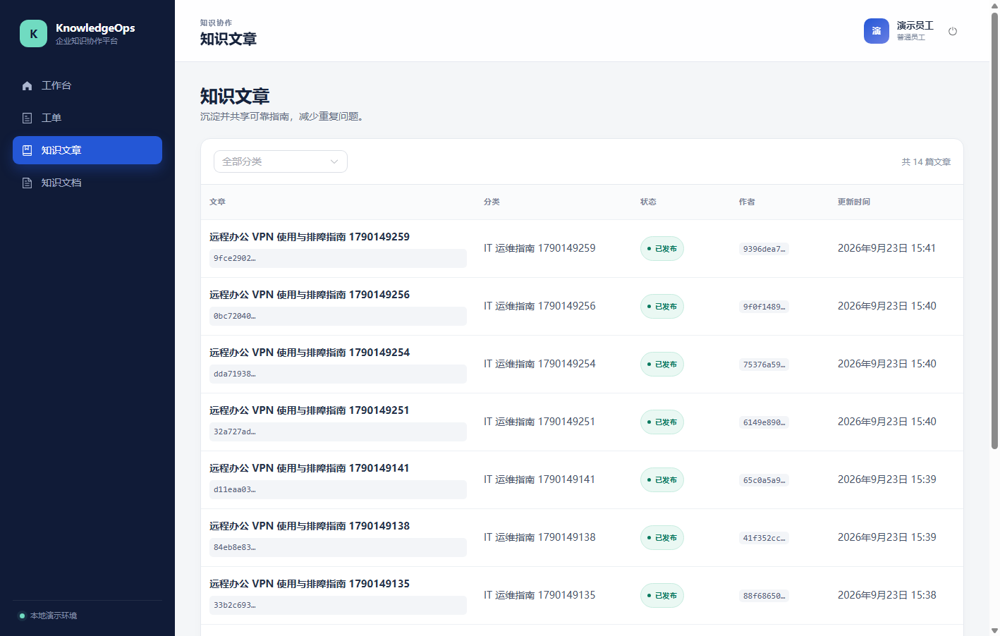
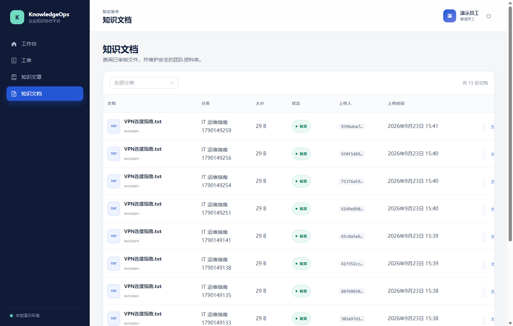
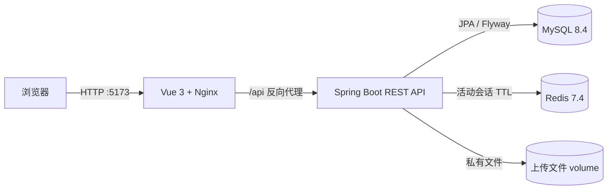
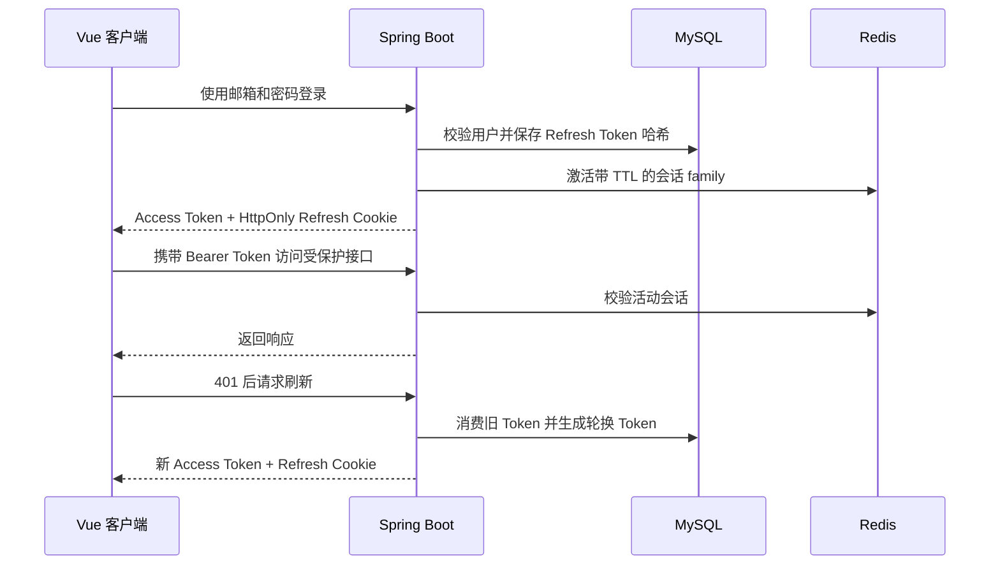
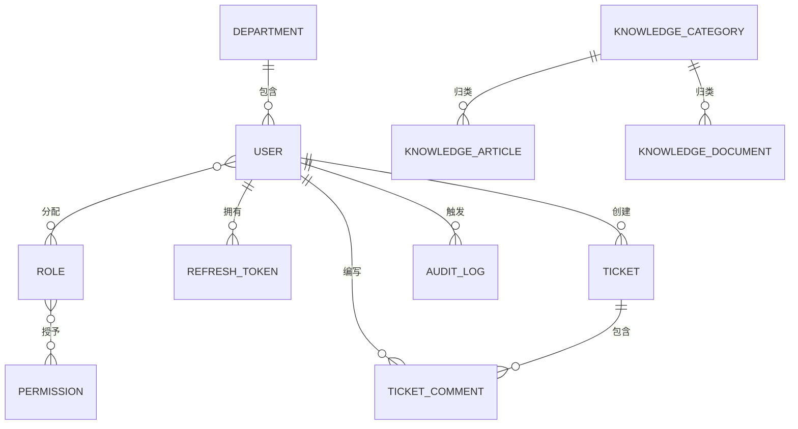

# KnowledgeOps 企业知识库与智能工单协作平台

> 使用 Spring Boot 与 Vue 构建的轻量企业内部工单和知识管理系统。

KnowledgeOps 是一个面向实习求职与技术面试的 Java 后端作品集项目。系统将安全认证、基于角色与资源的权限控制、工单协作、知识发布和私有文档管理整合为一套可实际运行的应用。

项目定位为小型企业内部工具，重点展示完整业务流程与可验证的工程决策，不将其包装为生产级 SaaS 平台。

## 界面预览

| 工作台 | 工单协作 |
| --- | --- |
|  |  |

| 知识文章 | 知识文档 |
| --- | --- |
|  |  |

其他界面：[登录](docs/images/login.png) · [工单列表](docs/images/tickets.png)

## 核心功能

### 身份认证与安全

- 使用邮箱和密码登录，密码通过 BCrypt 哈希保存。
- 使用短期 JWT Access Token 与可轮换的随机 Refresh Token。
- 使用 HttpOnly Refresh Cookie、CSRF 请求头校验、登出撤销和重放检测。
- 为普通员工、支持人员、知识管理员和系统管理员提供基于权限的 RBAC。
- 后端资源级检查可阻止普通员工读取他人创建的工单。
- 通过 requestId 和受限元数据记录审计事件。

### 工单管理

- 支持工单创建、筛选、分页和详情查看。
- 支持公开评论，并可将工单分配给符合条件的支持人员。
- 执行 `OPEN → IN_PROGRESS → RESOLVED → CLOSED` 状态流转，也支持从 `IN_PROGRESS` 返回 `OPEN`。
- 使用 JPA 乐观锁和显式版本号识别并发更新。

### 知识管理

- 创建知识分类和文章草稿，并支持编辑、发布与归档。
- 普通员工无法访问未发布或已归档内容。
- 支持 PDF、DOCX、TXT 和 Markdown 文档的上传、列表、下载与归档。
- 校验文件大小、文件名、扩展名、声明 MIME 类型、基础文件签名、存储路径边界和符号链接。
- 使用服务端生成的 UUID 文件名，将文件保存在私有持久化 volume 中。

### 工程验证

- Flyway 负责全部 MySQL schema 变更，Hibernate 使用 `ddl-auto=validate`。
- Redis 保存带 TTL 的活动认证会话状态。
- 业务变更与对应审计事件共享事务边界。
- Testcontainers 集成测试使用真实 MySQL 8.4 与 Redis 7.4 容器。
- Docker Compose 启动 Vue/Nginx 前端、Spring Boot 后端、MySQL、Redis 和持久化上传 volume。

## 技术栈

| 范围 | 技术 |
| --- | --- |
| 后端 | Java 21、Spring Boot 4.1、Spring Security、Spring Data JPA、Maven |
| 数据 | MySQL 8.4、Redis 7.4、Flyway |
| 前端 | Vue 3、TypeScript、Vite、Vue Router、Pinia、Axios、Element Plus |
| 运行环境 | Docker、Docker Compose、Nginx |
| 测试 | JUnit 5、Spring Boot Test、Testcontainers、ArchUnit、Vitest、ESLint |

## 系统架构



Java 应用采用模块化单体结构，按身份认证、用户、工单、知识、审计和共享基础设施划分。MySQL 是业务数据的事实来源；Redis 参与会话有效性校验，不作为通用缓存；Nginx 提供生产构建后的前端资源，并将 `/api` 代理到 Spring Boot。

系统边界、数据归属和运行时细节见[架构说明](docs/ARCHITECTURE.md)。

## 认证流程



Access Token 只保存在前端内存中；浏览器仅通过 HttpOnly Cookie 保存 Refresh Token。并发 401 响应会合并为一次前端刷新请求，登出时同时撤销 MySQL 中的 Token family 和 Redis 会话。

## 权限模型

| 角色 | 主要能力 |
| --- | --- |
| 普通员工 | 创建并查看本人工单、发表评论、阅读已发布文章、下载有效文档 |
| 支持人员 | 包含普通员工权限，并可读取部门工单、分配工单、流转分配给自己的工单 |
| 知识管理员 | 包含普通员工权限，并可管理分类、文章和文档 |
| 系统管理员 | 管理用户、角色与审计，并可全局管理工单和知识内容 |

前端路由与按钮权限用于改善交互体验，后端 Spring Security 权限检查和应用层资源检查才是最终安全边界。即使知道有效的工单 UUID，普通员工也无法读取他人创建的工单。

## 领域概览



已实现的 schema 包括身份与 RBAC、Refresh Token、审计日志、工单与评论、知识分类、文章和文档元数据。Flyway 迁移 `V1`–`V3` 是可执行的 schema 定义。

## 快速启动

环境要求：Docker Desktop，或支持 Compose 的 Docker Engine。

```bash
git clone <repository-url> knowledgeops
cd knowledgeops
cp .env.example .env
# 将 .env 中的本地密码和签名密钥占位值全部替换

docker compose --env-file .env config --quiet
docker compose --env-file .env up -d --build
docker compose ps
```

PowerShell 请使用 `Copy-Item .env.example .env` 代替 `cp`。

访问地址：

- 前端：<http://localhost:5173>
- 后端健康检查：<http://localhost:8080/actuator/health>
- OpenAPI UI：<http://localhost:8080/swagger-ui.html>

初始管理员邮箱和密码来自本地 `.env` 中的 `BOOTSTRAP_ADMIN_EMAIL` 与 `BOOTSTRAP_ADMIN_PASSWORD`。这些仅是开发环境启动值，不是生产凭据；系统有意不提供公开注册。

若要创建一次性的普通员工、支持人员和知识管理员账号，并通过前端代理执行完整 API 流程，请运行：

```powershell
.\frontend\tests\runtime-smoke.ps1
```

脚本会输出生成的账号邮箱，固定密码仅用于本地测试并明确保存在脚本中。停止环境：

```bash
docker compose --env-file .env down
```

## 验证方式

前端：

```bash
cd frontend
npm ci
npm run lint
npm run type-check
npm test
npm run build
```

后端需要 Java 21 和正在运行的 Docker daemon：

```bash
cd backend-java
./mvnw clean verify
```

Windows 请使用 `.\mvnw.cmd clean verify`。集成测试覆盖认证、Refresh Token 轮换、RBAC、工单资源授权与并发、文章可见性、文件校验与下载、审计记录和 Flyway 约束。

## 面试材料

- [3–5 分钟演示脚本](docs/DEMO_SCRIPT.md)
- [架构说明](docs/ARCHITECTURE.md)
- [面试问答](docs/INTERVIEW_GUIDE.md)
- [简历要点](docs/RESUME_BULLETS.md)
- [作品集摘要](docs/PORTFOLIO_SUMMARY.md)
- [Phase 5 验收报告](PHASE_5_PORTFOLIO_FINISH_REPORT.md)

## 范围与限制

KnowledgeOps 使用本地持久化文件存储，目前没有全文检索、对象存储、生产部署或生产 CI/CD 流水线。AI、RAG、向量检索、Python 服务、微服务、Kubernetes、通知和数据分析均未实现。仓库保留部分 Phase 0 设计资料作为规划历史，[文档索引](docs/README.md)会区分历史提案与最终交付系统。

开发已在 Phase 5 完成。仓库现用于作品集审阅、面试演示和求职材料展示。
