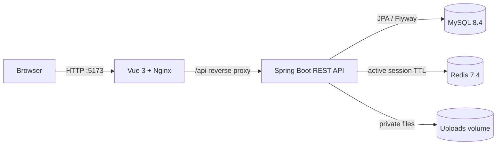
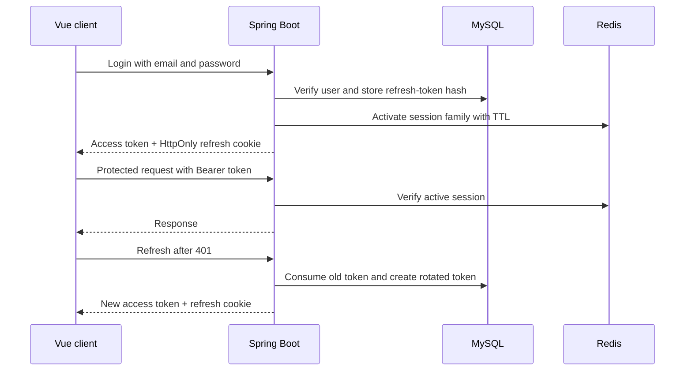
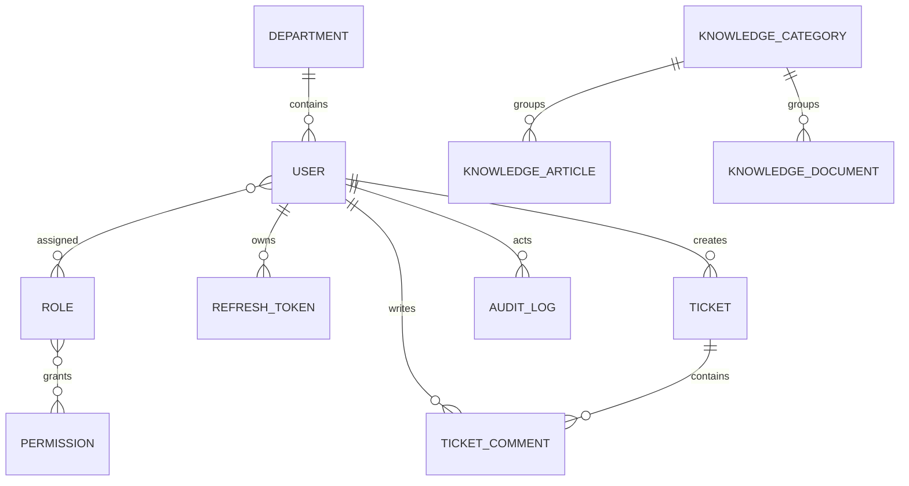

# KnowledgeOps

> A lightweight internal ticket and knowledge management system built with Spring Boot and Vue.

KnowledgeOps is a portfolio project focused on practical Java backend engineering. It combines secure authentication, role-based and resource-level authorization, ticket collaboration, knowledge publishing, and private document handling in one runnable application.

The project is intentionally scoped as a small internal tool. It demonstrates complete business flows and testable engineering decisions without presenting itself as a production-scale SaaS platform.

## Demo preview

| Dashboard | Ticket workflow |
| --- | --- |
|  |  |

| Knowledge articles | Documents |
| --- | --- |
|  |  |

Additional views: [Login](docs/images/login.png) · [Ticket list](docs/images/tickets.png)

## Key features

### Authentication and security

- Email/password login with BCrypt password hashing.
- Short-lived JWT access tokens and rotating opaque refresh tokens.
- HttpOnly refresh cookie, CSRF header check, logout revocation, and replay detection.
- Permission-based RBAC for Employee, Support Agent, Knowledge Manager, and Administrator.
- Backend resource checks prevent employees from reading another employee's ticket.
- Request IDs and audit events with deliberately limited metadata.

### Ticket management

- Create, filter, paginate, and inspect tickets.
- Add public comments and assign tickets to eligible support users.
- Enforce the `OPEN → IN_PROGRESS → RESOLVED → CLOSED` workflow, including the supported return to `OPEN`.
- Detect concurrent updates with JPA optimistic locking and explicit expected versions.

### Knowledge management

- Create categories and draft articles, then edit, publish, or archive them.
- Keep unpublished and archived content unavailable to ordinary employees.
- Upload, list, download, and archive PDF, DOCX, TXT, and Markdown documents.
- Validate file size, filename, extension, declared MIME type, basic signature, storage containment, and symbolic links.
- Store files under server-generated UUID names in a private persistent volume.

### Engineering evidence

- Flyway owns all MySQL schema changes; Hibernate runs with `ddl-auto=validate`.
- Redis stores active authentication-session state with TTL.
- Business changes and their audit events share transaction boundaries.
- Testcontainers integration suites use real MySQL 8.4 and Redis 7.4 containers.
- Docker Compose starts the Vue/Nginx frontend, Spring Boot backend, MySQL, Redis, and persistent uploads volume.

## Tech stack

| Area | Technology |
| --- | --- |
| Backend | Java 21, Spring Boot 4.1, Spring Security, Spring Data JPA, Maven |
| Data | MySQL 8.4, Redis 7.4, Flyway |
| Frontend | Vue 3, TypeScript, Vite, Vue Router, Pinia, Axios, Element Plus |
| Runtime | Docker, Docker Compose, Nginx |
| Testing | JUnit 5, Spring Boot Test, Testcontainers, ArchUnit, Vitest, ESLint |

## Architecture



The Java application is a modular monolith organized around authentication, users, tickets, knowledge, audit, and shared infrastructure. MySQL is the business source of truth. Redis participates in session validity checks; it is not used as a general cache. Nginx serves the production frontend and proxies `/api` to Spring Boot.

See [Architecture](docs/ARCHITECTURE.md) for boundaries, data ownership, and runtime details.

## Authentication flow



The access token stays in frontend memory. The browser holds the refresh token only as an HttpOnly cookie. Concurrent 401 responses share one frontend refresh request, and logout revokes both the MySQL token family and Redis session.

## Authorization model

| Role | Main capabilities |
| --- | --- |
| Employee | Create and read own tickets, comment, read published articles, download active documents |
| Support Agent | Employee access plus department ticket reading, assignment, and assigned-ticket transitions |
| Knowledge Manager | Employee access plus category, article, and document management |
| Administrator | User/role and audit administration plus global ticket and knowledge management |

Frontend route and button checks improve the user experience. They are not the security boundary. Spring Security permission checks and application-level resource checks make the final decision. For example, possession of a valid ticket UUID does not let an employee read a ticket created by someone else.

## Domain overview



The implemented schema contains identity/RBAC, refresh tokens, audit logs, tickets and comments, knowledge categories, articles, and document metadata. Flyway migrations `V1`–`V3` are the executable schema definition.

## Quick start

Requirements: Docker Desktop or Docker Engine with Compose support.

```bash
git clone <repository-url> knowledgeops
cd knowledgeops
cp .env.example .env
# Replace every local password and signing-secret placeholder in .env
docker compose --env-file .env config --quiet
docker compose --env-file .env up -d --build
docker compose ps
```

PowerShell uses `Copy-Item .env.example .env` instead of `cp`.

Open:

- Frontend: <http://localhost:5173>
- Backend health: <http://localhost:8080/actuator/health>
- OpenAPI UI: <http://localhost:8080/swagger-ui.html>

The bootstrap administrator email and password come from `BOOTSTRAP_ADMIN_EMAIL` and `BOOTSTRAP_ADMIN_PASSWORD` in the ignored local `.env`. They are development bootstrap values, not production credentials. Public registration is intentionally unavailable.

To create disposable Employee, Support Agent, and Knowledge Manager accounts and exercise the complete API through the frontend proxy:

```powershell
.\frontend\tests\runtime-smoke.ps1
```

The script prints the generated account emails. Its fixed passwords are local test data and are visible in the script. Stop the environment with:

```bash
docker compose --env-file .env down
```

## Verification

Frontend:

```bash
cd frontend
npm ci
npm run lint
npm run type-check
npm test
npm run build
```

Backend (Java 21 and a running Docker daemon are required for Testcontainers):

```bash
cd backend-java
./mvnw clean verify
```

On Windows use `.\mvnw.cmd clean verify`. The integration suites cover authentication, refresh rotation, RBAC, ticket resource authorization and concurrency, article visibility, file validation and download, audit records, and Flyway constraints.

## Interview material

- [3–5 minute demo script](docs/DEMO_SCRIPT.md)
- [Architecture](docs/ARCHITECTURE.md)
- [Interview guide](docs/INTERVIEW_GUIDE.md)
- [Resume bullets](docs/RESUME_BULLETS.md)
- [Portfolio summary](docs/PORTFOLIO_SUMMARY.md)
- [Phase 5 verification report](PHASE_5_PORTFOLIO_FINISH_REPORT.md)

## Scope and limitations

KnowledgeOps uses local persistent file storage and has no full-text search, object storage, production deployment, or production CI/CD pipeline. AI, RAG, vector search, Python services, microservices, Kubernetes, notifications, and analytics are not implemented. The repository retains some Phase 0 design artifacts as planning history; [the documentation index](docs/README.md) clearly separates those proposals from the delivered system.

Development is complete at Phase 5. The repository is now intended for portfolio review, interview demonstrations, and job applications.
