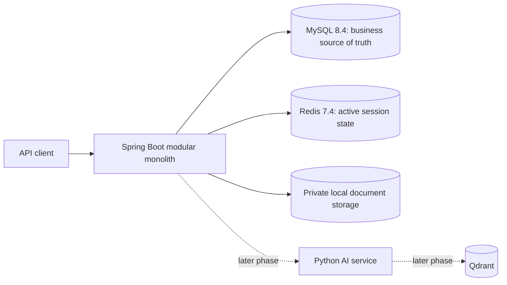

# KnowledgeOps AI

企业知识库与智能工单协作平台 · Java Enterprise Backend + Python AI Application

**当前状态：Phase 3 Simple Knowledge Management 已实现。** Java 后端现包含身份与权限、简单工单、知识分类、文章发布和安全的本地文档存储。Python AI、RAG、Agent 和前端仍未实现。

## Current implementation

- 身份与权限：email 登录、JWT access token、旋转 refresh token、登出、用户/角色管理和 permission-based RBAC。
- 工单：创建、范围内查询、同部门分派、状态机、公开评论、乐观锁与审计。
- 知识文章：单层分类、草稿创建和编辑、发布、归档、分页与分类/状态过滤、乐观锁。
- 知识文档：PDF、DOCX、TXT、Markdown 上传，20 MiB 业务限制，本地 UUID 存储键，列表、鉴权下载和归档。
- 安全：普通员工只读已发布文章和有效文档；Knowledge Manager 与 Administrator 按权限管理内容；文件名、扩展名、MIME、基础签名、路径和符号链接均经过检查。
- 数据与运行：Flyway V1–V3、MySQL 8.4、Redis 7.4、`ddl-auto=validate`、Actuator health、OpenAPI、非 root Java 21 容器和持久化 `uploads-data` volume。
- 验证：JUnit、ArchUnit、Spotless，以及 MySQL/Redis Testcontainers 对 Phase 1–3 的集成回归。

Product Scope 禁止公开注册，因此没有 `/auth/register`。首次管理员由显式开启的 `BOOTSTRAP_ADMIN_*` 配置创建，之后不会覆盖既有密码。Phase 0 contract 的 username/email 差异记录在 [CONTRACT_DEVIATION.md](docs/CONTRACT_DEVIATION.md)。

## Architecture



Java 是业务 Source of Truth。Python AI 未来只负责 AI 能力，不持有核心业务数据库权限；核心业务必须能在 AI 不可用时运行。完整边界见 [ARCHITECTURE.md](docs/ARCHITECTURE.md) 和 ADR。

## Run

需要 Docker Desktop Linux containers。复制示例配置并替换本地演示口令：

```powershell
Copy-Item .env.example .env
docker compose --env-file .env config --quiet
docker compose --env-file .env up -d --build mysql redis java-backend
docker compose ps
Invoke-RestMethod http://localhost:8080/actuator/health
```

Swagger UI 位于 `http://localhost:8080/swagger-ui.html`。主要入口包括：

- `POST /api/v1/auth/login`、`GET /api/v1/users/me`
- `GET|POST /api/v1/tickets`
- `GET|POST /api/v1/knowledge/categories`
- `GET|POST /api/v1/knowledge/articles`
- `GET|POST /api/v1/documents`、`GET /api/v1/documents/{id}/content`

停止服务：

```powershell
docker compose --env-file .env down
```

Qdrant 位于 `later-phases` profile，默认不会启动。`infra/compose.application.yml` 仍是未来完整拓扑；检查该 overlay 时需显式加入 `--profile later-phases`。

## Test

本机需使用 Java 21，并确保 Docker daemon 可供 Testcontainers 使用：

```powershell
Set-Location backend-java
.\mvnw.cmd clean verify
```

macOS/Linux 使用 `./mvnw clean verify`。完整测试会启动真实 MySQL/Redis 容器，覆盖认证、RBAC、工单、文章可见性与并发、文件上传/下载/归档、路径穿越、大小与类型限制、Flyway 约束和审计。

Phase 0 静态资产仍可验证：

```powershell
python -m pip install -r scripts/requirements-architecture.txt
python scripts/validate_architecture.py
```

## Reading map

- [Phase 1 验收报告](PHASE_1_JAVA_FOUNDATION_REPORT.md)
- [Phase 2 验收报告](PHASE_2_TICKET_SYSTEM_REPORT.md)
- [Phase 3 验收报告](PHASE_3_KNOWLEDGE_MANAGEMENT_REPORT.md)
- [产品范围](docs/PRODUCT_SCOPE.md)、[架构](docs/ARCHITECTURE.md)、[Domain](docs/DOMAIN_MODEL.md)
- [数据库与 ERD](docs/DATABASE_DESIGN.md)、[API Contract](docs/API_CONTRACT.md)、[OpenAPI](docs/contracts/README.md)
- [安全模型](docs/SECURITY_MODEL.md)、[测试策略](docs/TEST_STRATEGY.md)、[实施计划](docs/IMPLEMENTATION_PLAN.md)

## Current limitations

当前没有文档解析、版本工作流、全文检索、对象存储、Python AI、RAG、embedding、Agent、Qdrant 业务集成或 Vue 页面。知识文档保存在 Java 服务的私有本地 volume 中；归档保留文件。身份模块面向本地/作品集演示，使用单一 HMAC secret，尚无密钥轮换服务或外部身份提供方。
