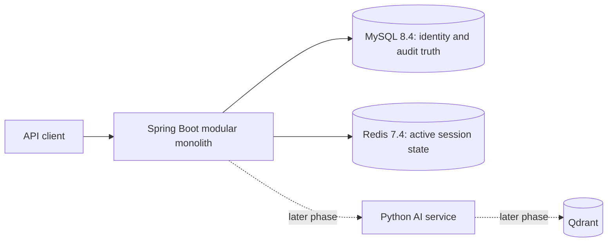

# KnowledgeOps AI

企业知识库与智能工单协作平台 · Java Enterprise Backend + Python AI Application

**当前状态：Phase 1 Java Backend Foundation 已实现。** 本仓库当前可构建 Java 业务后端，并包含身份认证、授权、审计、MySQL/Redis 配置与自动化测试。Ticket、知识库、文档处理、Python AI、RAG、Agent 和前端仍只有 Phase 0 契约或占位，不属于已实现能力。

## Current implementation

已实现的 Java 模块为 `auth`、`user`、`audit` 和 `shared`：

- email 登录、短期 JWT access token、旋转且可撤销的 opaque refresh token、登出；
- `EMPLOYEE`、`SUPPORT_AGENT`、`KNOWLEDGE_MANAGER`、`ADMINISTRATOR` 固定角色与 permission-based RBAC；
- 最小管理员用户创建、用户状态和角色管理 API；
- Flyway 管理的 8 张 Phase 1 表，JPA 使用 `ddl-auto=validate`；
- 统一错误响应、`X-Request-ID`、MDC/access log、白名单审计事件；
- bootstrap administrator、Actuator/应用 health、运行时 OpenAPI；
- Java 21 Maven Wrapper、Spotless、JUnit/ArchUnit、MySQL 8.4 与 Redis 7.4 Testcontainers、GitHub Actions；
- Java 21 多阶段非 root Docker image，以及 Java + MySQL + Redis Compose 拓扑。

Product Scope 禁止公开注册，因此没有 `/auth/register`。首次管理员由显式开启的 `BOOTSTRAP_ADMIN_*` 配置创建，之后不会覆盖既有密码。Phase 0 contract 的 username/email 差异记录在 [CONTRACT_DEVIATION.md](docs/CONTRACT_DEVIATION.md)。

## Architecture



Java 是业务 Source of Truth。Python AI 未来只负责 AI 能力，不持有核心业务数据库权限；核心业务必须能在 AI 不可用时运行。完整边界见 [ARCHITECTURE.md](docs/ARCHITECTURE.md) 和 ADR。

## Run Phase 1

需要 Docker Desktop Linux containers。复制示例配置并替换本地演示口令：

```powershell
Copy-Item .env.example .env
docker compose --env-file .env config --quiet
docker compose --env-file .env up -d --build mysql redis java-backend
docker compose ps
Invoke-RestMethod http://localhost:8080/actuator/health
```

Swagger UI 位于 `http://localhost:8080/swagger-ui.html`。登录端点为 `POST /api/v1/auth/login`，当前用户端点为 `GET /api/v1/users/me`。停止服务：

```powershell
docker compose --env-file .env down
```

Qdrant 位于 `later-phases` profile，Phase 1 默认不会启动。`infra/compose.application.yml` 仍是未来完整拓扑；检查该 overlay 时需显式加入 `--profile later-phases`。

## Test

本机需使用 Java 21：

```powershell
Set-Location backend-java
.\mvnw.cmd clean verify
```

macOS/Linux 使用 `./mvnw clean verify`。Docker daemon 可用时，Failsafe 会运行 MySQL/Redis Testcontainers 集成测试，覆盖 bootstrap、登录、用户创建、重复 email、RBAC、refresh rotation、logout/revoke、禁用用户、错误结构、Request ID 和审计。Docker 不可用时集成测试明确显示为 skipped，单元与架构测试仍执行；CI 的 Ubuntu runner 会运行完整 Testcontainers 流程。

Phase 0 静态资产仍可验证：

```powershell
python -m pip install -r scripts/requirements-architecture.txt
python scripts/validate_architecture.py
```

## Reading map

- [Phase 1 实现说明](docs/PHASE_1_JAVA_FOUNDATION.md)
- [Phase 1 验收报告](PHASE_1_JAVA_FOUNDATION_REPORT.md)
- [产品范围](docs/PRODUCT_SCOPE.md)、[架构](docs/ARCHITECTURE.md)、[Domain](docs/DOMAIN_MODEL.md)
- [数据库与 ERD](docs/DATABASE_DESIGN.md)、[API Contract](docs/API_CONTRACT.md)、[OpenAPI](docs/contracts/README.md)
- [安全模型](docs/SECURITY_MODEL.md)、[测试策略](docs/TEST_STRATEGY.md)、[实施计划](docs/IMPLEMENTATION_PLAN.md)
- [Phase 0 架构报告](ARCHITECTURE_PHASE_REPORT.md)、[ADR](docs/ADR/README.md)

## Current limitations

当前没有 Ticket、Knowledge、Document Pipeline、Python AI、RAG、Agent、Qdrant 业务集成或 Vue 页面。身份模块面向本地/作品集演示，使用单一 HMAC secret，尚无密钥轮换服务或外部身份提供方。Department 只有 `GENERAL` 种子数据，审计 append-only 由应用 API 边界保证。
