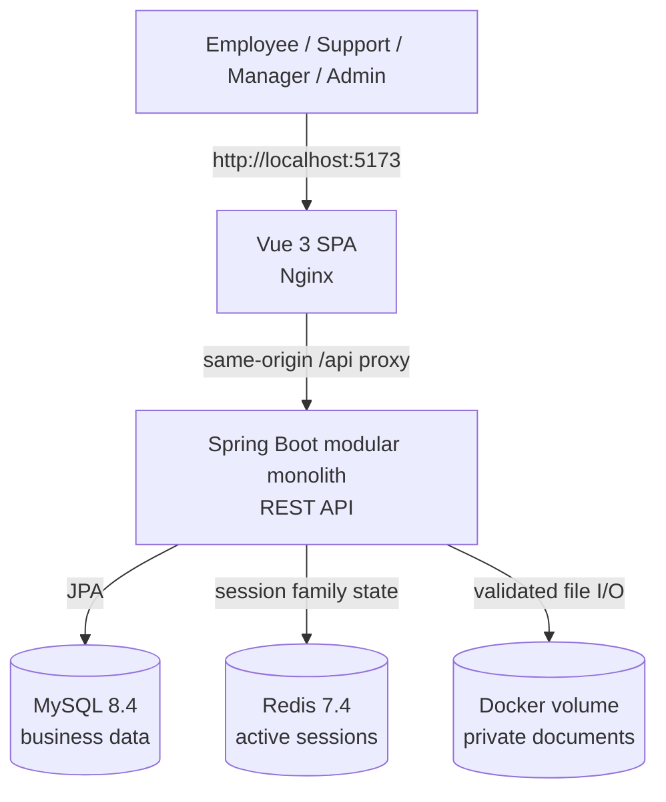

# KnowledgeOps architecture

This document describes the final implemented system. It replaces the broader Phase 0 proposal as the runtime reference.

## System context

The default Compose topology runs four services: `frontend`, `java-backend`, `mysql`, and `redis`. Nginx serves the built SPA and proxies API requests. The backend is also bound to localhost port 8080 for health checks and OpenAPI during development.

## Backend structure

The Java service is a modular monolith under `com.knowledgeops`:

| Module | Responsibility |
| --- | --- |
| `auth` | Login, JWT creation/validation, refresh rotation, CSRF validation, session registry |
| `user` | Users, departments, fixed roles, permissions, administrator operations |
| `ticket` | Ticket queries, comments, assignment, status policy, resource authorization |
| `knowledge` | Categories, article lifecycle, document metadata and private file storage |
| `audit` | Append-only security and business action records |
| `shared` | Request IDs, error responses, common configuration |

Controllers validate transport input and delegate to application services. Application services own transaction boundaries and resource checks. Domain entities hold state and optimistic versions. Infrastructure adapters connect JPA repositories, Redis, and local storage.

## Data ownership

- **MySQL** is the source of truth for users, RBAC, refresh-token hashes, audit records, tickets, comments, categories, articles, and document metadata.
- **Redis** stores `session:{familyId}=ACTIVE` values with refresh-session TTL. Missing or unavailable session state fails authentication closed.
- **Uploads volume** contains validated source files under server-generated UUID filenames. It is not exposed as a static web directory.
- **Flyway** migrations `V1`–`V3` own the schema. Hibernate uses `ddl-auto=validate`.

No Python or AI service participates in the implemented runtime. The optional `later-phases` Qdrant profile is a retained architecture artifact and is not part of KnowledgeOps Phase 5.

## Authentication and session lifecycle

1. The backend normalizes the email, checks the active user, and verifies a BCrypt hash.
2. It creates a random 256-bit opaque refresh token, stores only its SHA-256 hash in MySQL, and activates the token family in Redis.
3. It returns a signed short-lived JWT access token and sets the refresh token as an HttpOnly cookie. A separate readable CSRF value must match the refresh/logout request header.
4. Each bearer-token request verifies the JWT, reloads the current user/permissions, and checks both Redis session state and a live refresh family in MySQL.
5. Refresh locks and consumes the old token, creates the next token in the same family, and records an audit event. Reuse of a consumed token revokes the family.
6. Logout revokes the family in MySQL, removes its Redis key, clears cookies, and prevents later refresh.

The Vue client stores the access token only in memory. It keeps the CSRF value in `sessionStorage` to restore a tab after reload. Axios coalesces concurrent 401 responses into one refresh and retries each original request once.

## Authorization

Spring Security method annotations enforce coarse permissions. Application services then enforce resource rules:

- Employees can access only tickets they created.
- Support Agents can work with tickets in their department and transition tickets assigned to themselves.
- Administrators can manage all tickets, while assignment targets must still be active support-capable users in the ticket department.
- Employees see only published articles and active documents.
- Knowledge Managers and Administrators can manage knowledge content.

This second layer prevents IDOR: a valid resource identifier is insufficient without access to that resource. The frontend mirrors permission checks to hide unavailable routes and controls, but every API request is authorized again by the backend.

## Transactions and concurrency

`@Transactional` application methods group each business mutation with its audit record. Examples include ticket creation, comment, assignment and transition; article create/update/publish/archive; document metadata changes; and refresh-token rotation.

`Ticket`, `KnowledgeArticle`, and `User` use JPA `@Version`. Ticket and article update requests include `expectedVersion`; stale writers receive HTTP 409 rather than silently overwriting a newer change. The ticket state policy allows only:

- `OPEN → IN_PROGRESS`
- `IN_PROGRESS → OPEN | RESOLVED`
- `RESOLVED → CLOSED`

## Secure document storage

Upload accepts PDF, DOCX, TXT, Markdown, and a maximum of 20 MiB. Validation covers normalized filenames, allowed extensions, declared MIME types, basic PDF/DOCX signatures, UTF-8 text validity, root containment, and symbolic links. The API never returns a storage key or filesystem path.

File bytes are written before document metadata commits. A transaction synchronization deletes the new file if the database transaction rolls back. Archive changes metadata while retaining the physical file. Authorized downloads read bytes through the storage service and create an audit event.

## Audit and request tracing

`RequestIdFilter` accepts or creates a request ID, exposes it in responses, and makes it available to audit writes. Audit records include actor, action, resource, timestamp, request ID, and a small allowlisted metadata map. Passwords, JWTs, refresh tokens, Authorization headers, article bodies, comments, and filesystem paths are excluded.

## Runtime and verification

Docker Compose isolates MySQL and Redis on an internal network and persists database, Redis, and upload data in named volumes. Health checks gate dependent services. Integration tests use Testcontainers with real MySQL 8.4 and Redis 7.4 rather than replacing their behavior with in-memory databases.

See the root [README](../README.md) for startup commands and [Phase 5 report](../PHASE_5_PORTFOLIO_FINISH_REPORT.md) for the final verification evidence.
