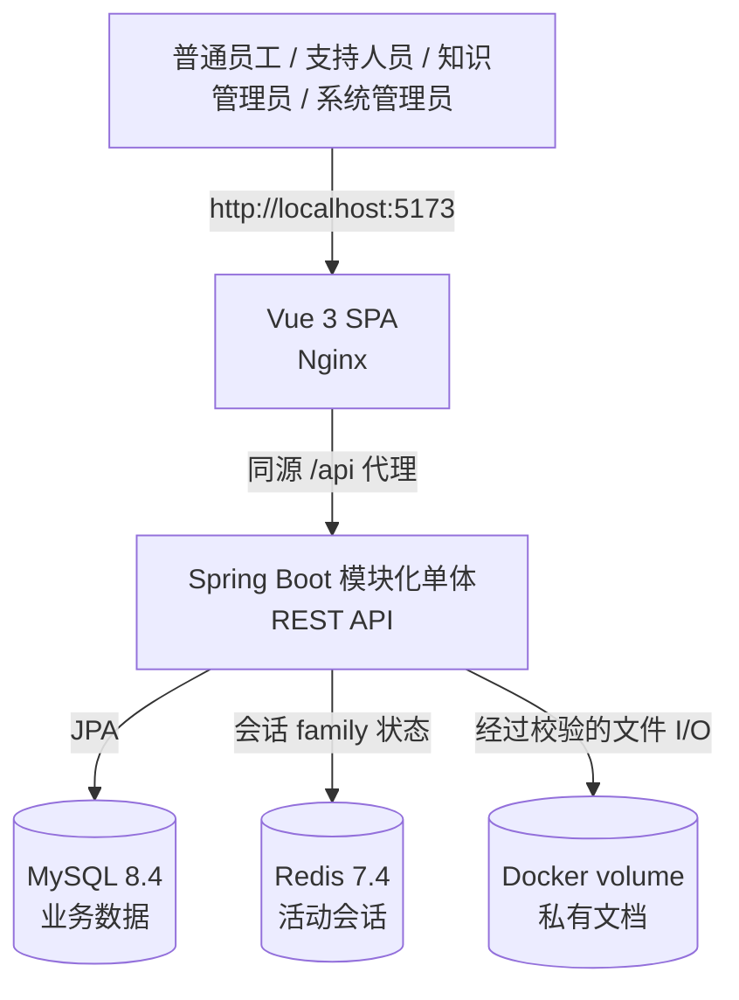

# KnowledgeOps 架构说明

本文描述最终已经实现的系统，是运行时架构的主要参考；它取代范围更广的 Phase 0 提案。

## 系统上下文

默认 Compose 拓扑运行 `frontend`、`java-backend`、`mysql` 和 `redis` 四个服务。Nginx 提供构建后的 SPA，并代理 API 请求。后端也绑定到本机 8080 端口，供开发时执行健康检查和访问 OpenAPI。

## 后端结构

Java 服务采用 `com.knowledgeops` 下的模块化单体结构：

| 模块 | 职责 |
| --- | --- |
| `auth` | 登录、JWT 创建与校验、Refresh Token 轮换、CSRF 校验、会话注册表 |
| `user` | 用户、部门、固定角色、权限和管理员操作 |
| `ticket` | 工单查询、评论、分配、状态规则和资源授权 |
| `knowledge` | 分类、文章生命周期、文档元数据和私有文件存储 |
| `audit` | 仅追加的安全与业务操作记录 |
| `shared` | requestId、错误响应和公共配置 |

Controller 校验传输层输入后调用应用服务。应用服务负责事务边界与资源级检查，领域实体保存状态和乐观锁版本，基础设施适配器连接 JPA repository、Redis 和本地文件存储。

## 数据归属

- **MySQL** 是用户、RBAC、Refresh Token 哈希、审计记录、工单、评论、分类、文章和文档元数据的事实来源。
- **Redis** 使用 Refresh Session TTL 保存 `session:{familyId}=ACTIVE`。会话状态缺失或 Redis 不可用时，认证按 fail closed 处理。
- **Uploads volume** 使用服务端生成的 UUID 文件名保存已校验的原始文件，不对外作为静态目录暴露。
- **Flyway** migration `V1`–`V3` 负责 schema；Hibernate 使用 `ddl-auto=validate`。

已经实现的运行时不包含 Python 或 AI 服务。`later-phases` 中可选的 Qdrant profile 只是保留的架构资料，不属于 KnowledgeOps Phase 5。

## 认证与会话生命周期

1. 后端规范化邮箱，检查用户是否有效，再校验 BCrypt 密码哈希。
2. 后端生成随机 256-bit opaque Refresh Token，只在 MySQL 中保存 SHA-256 哈希，并在 Redis 中激活对应的 Token family。
3. 后端返回签名的短期 JWT Access Token，并将 Refresh Token 写入 HttpOnly Cookie。刷新与登出请求还必须携带匹配的可读 CSRF 值。
4. 每次 Bearer Token 请求都会校验 JWT、重新加载当前用户与权限，并检查 Redis 会话及 MySQL 中仍有效的 Refresh family。
5. 刷新操作会锁定并消费旧 Token，在同一 family 中创建新 Token，并写入审计事件；再次使用已消费 Token 会撤销整个 family。
6. 登出会撤销 MySQL family、删除 Redis key、清除 Cookie，并阻止后续刷新。

Vue 客户端只在内存中保存 Access Token，并将 CSRF 值放入 `sessionStorage`，用于页面刷新后恢复当前标签页。Axios 会将并发 401 合并为一次刷新，并只重试每个原请求一次。

## 权限控制

Spring Security 方法注解执行粗粒度权限检查，应用服务继续执行资源级规则：

- 普通员工只能访问自己创建的工单。
- 支持人员可以处理本部门工单，并且只能流转分配给自己的工单。
- 系统管理员可以管理全部工单，但处理人仍必须是工单所属部门中有效且具备支持能力的用户。
- 普通员工只能查看已发布文章和有效文档。
- 知识管理员与系统管理员可以管理知识内容。

第二层检查用于防止 IDOR：仅知道有效资源标识并不足以获得资源访问权。前端会同步权限状态以隐藏不可用路由和操作，但每个 API 请求仍由后端再次授权。

## 事务与并发

带有 `@Transactional` 的应用方法会将业务变更和对应审计记录放在同一事务中，包括工单创建、评论、分配和流转；文章创建、更新、发布和归档；文档元数据变更；以及 Refresh Token 轮换。

`Ticket`、`KnowledgeArticle` 和 `User` 使用 JPA `@Version`。工单和文章更新请求携带 `expectedVersion`；版本过期时返回 HTTP 409，避免静默覆盖新数据。工单状态规则只允许：

- `OPEN → IN_PROGRESS`
- `IN_PROGRESS → OPEN | RESOLVED`
- `RESOLVED → CLOSED`

## 安全文档存储

上传接口接受最大 20 MiB 的 PDF、DOCX、TXT 和 Markdown。校验范围包括规范化文件名、允许的扩展名、声明 MIME 类型、PDF/DOCX 基础签名、UTF-8 文本合法性、storage root 边界和符号链接。API 不返回 storage key 或本机文件路径。

系统先写入文件内容，再提交文档元数据。事务同步回调会在数据库事务回滚时删除新文件。归档只修改元数据并保留物理文件；已授权下载通过 storage service 读取内容并记录审计事件。

## 审计与请求追踪

`RequestIdFilter` 接受或生成 requestId，将其写入响应并提供给审计操作。审计记录包括 actor、action、resource、时间、requestId 和少量白名单 metadata。密码、JWT、Refresh Token、Authorization header、文章正文、评论和文件系统路径均不会进入 metadata。

## 运行与验证

Docker Compose 将 MySQL 和 Redis 隔离在内部网络，并通过具名 volume 持久化数据库、Redis 和上传数据。健康检查会控制依赖服务的启动顺序。集成测试使用 Testcontainers 运行真实 MySQL 8.4 和 Redis 7.4，不以嵌入式数据库替代其行为。

启动命令见根目录 [README](../README.md)，最终验收证据见 [Phase 5 报告](../PHASE_5_PORTFOLIO_FINISH_REPORT.md)。
