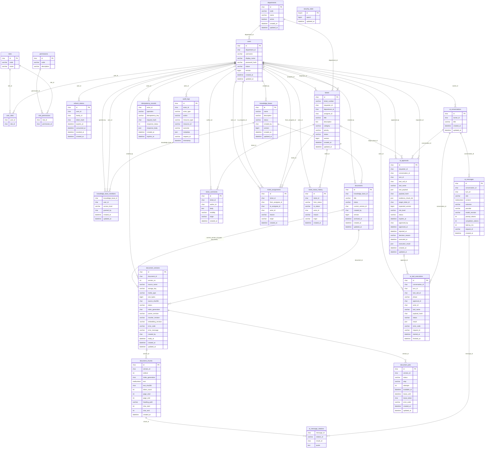

# Complete ERD

来源：[schema.sql](schema.sql)。包含所有表与 FK；关联表表示多对多，空心端表示可空关联。字段类型和完整约束以 SQL 为准。

```mermaid
erDiagram
  departments {
    char id PK
    varchar code
    varchar name
    boolean active
    datetime created_at
    datetime updated_at
  }
  users {
    char id PK
    char department_id
    varchar username
    varchar display_name
    varchar password_hash
    varchar status
    bigint version
    datetime created_at
    datetime updated_at
  }
  roles {
    char id PK
    varchar code
    varchar name
  }
  permissions {
    char id PK
    varchar code
    varchar description
  }
  user_roles {
    char user_id
    char role_id
  }
  role_permissions {
    char role_id
    char permission_id
  }
  security_state {
    tinyint id PK
    bigint epoch
    datetime updated_at
  }
  refresh_tokens {
    char id PK
    char user_id
    char family_id
    char token_hash
    datetime expires_at
    datetime consumed_at
    datetime revoked_at
    datetime created_at
  }
  knowledge_bases {
    char id PK
    varchar name
    varchar description
    varchar status
    char created_by
    bigint version
    datetime created_at
    datetime updated_at
  }
  knowledge_base_members {
    char knowledge_base_id
    char user_id
    varchar access_level
    char granted_by
    datetime created_at
    datetime updated_at
  }
  documents {
    char id PK
    char knowledge_base_id
    varchar title
    varchar status
    char current_version_id
    char created_by
    bigint version
    datetime archived_at
    datetime created_at
    datetime updated_at
  }
  document_versions {
    char id PK
    char document_id
    int version_no
    varchar source_name
    varchar storage_key
    varchar media_type
    bigint size_bytes
    char source_sha256
    varchar status
    char index_generation
    varchar parser_revision
    varchar chunker_revision
    varchar embedding_revision
    varchar error_code
    varchar error_message
    char created_by
    datetime ready_at
    datetime created_at
    datetime updated_at
  }
  document_chunks {
    char id PK
    char version_id
    int ordinal
    char index_generation
    mediumtext text
    char text_sha256
    int token_count
    int page_start
    int page_end
    varchar heading_path
    int char_start
    int char_end
    datetime created_at
  }
  document_jobs {
    char id PK
    char version_id
    varchar status
    varchar step
    int attempts
    datetime available_at
    datetime lease_until
    char lease_token
    varchar error_code
    datetime created_at
    datetime updated_at
  }
  tickets {
    char id PK
    varchar ticket_number
    char requester_id
    char department_id
    char assignee_id
    varchar title
    text description
    varchar category
    varchar priority
    varchar status
    bigint version
    datetime created_at
    datetime updated_at
  }
  ticket_comments {
    char id PK
    char ticket_id
    char author_id
    text body
    varchar visibility
    varchar origin
    datetime created_at
  }
  ticket_assignments {
    char id PK
    char ticket_id
    char from_assignee_id
    char to_assignee_id
    char actor_id
    varchar reason
    varchar origin
    datetime created_at
  }
  ticket_status_history {
    char id PK
    char ticket_id
    varchar from_status
    varchar to_status
    char actor_id
    varchar reason
    varchar origin
    datetime created_at
  }
  ai_conversations {
    char id PK
    char owner_id
    varchar title
    datetime created_at
    datetime updated_at
  }
  ai_messages {
    char id PK
    char conversation_id
    char turn_id
    varchar role
    mediumtext content
    varchar outcome
    varchar provider
    varchar model_revision
    int prompt_tokens
    int completion_tokens
    int latency_ms
    varchar request_id
    datetime created_at
  }
  ai_message_citations {
    char message_id
    varchar citation_id
    char chunk_id
    text quote
  }
  ai_approvals {
    char id PK
    char requester_id
    char conversation_id
    char turn_id
    char tool_call_id
    varchar tool_name
    json tool_payload
    char payload_hash
    json evidence_chunk_ids
    char target_ticket_id
    bigint expected_version
    varchar risk_level
    varchar status
    datetime expires_at
    char approved_by
    datetime approved_at
    datetime rejected_at
    varchar decision_reason
    datetime executed_at
    json execution_result
    datetime created_at
    datetime updated_at
  }
  ai_tool_executions {
    char id PK
    char conversation_id
    char turn_id
    char tool_call_id
    varchar phase
    char approval_id
    char actor_id
    varchar tool_name
    char payload_hash
    varchar status
    json result
    varchar error_code
    varchar request_id
    datetime started_at
    datetime finished_at
  }
  idempotency_records {
    char actor_id
    varchar operation
    varchar idempotency_key
    char request_hash
    int response_status
    json response_body
    datetime created_at
    datetime expires_at
  }
  audit_logs {
    char id PK
    char actor_id
    varchar actor_type
    varchar action
    varchar resource_type
    varchar resource_id
    varchar outcome
    json metadata
    varchar request_id
    datetime timestamp
  }
  departments ||--o{ users : "department_id"
  users ||--o{ user_roles : "user_id"
  roles ||--o{ user_roles : "role_id"
  roles ||--o{ role_permissions : "role_id"
  permissions ||--o{ role_permissions : "permission_id"
  users ||--o{ refresh_tokens : "user_id"
  users ||--o{ knowledge_bases : "created_by"
  knowledge_bases ||--o{ knowledge_base_members : "knowledge_base_id"
  users ||--o{ knowledge_base_members : "user_id"
  users ||--o{ knowledge_base_members : "granted_by"
  knowledge_bases ||--o{ documents : "knowledge_base_id"
  users ||--o{ documents : "created_by"
  documents ||--o{ document_versions : "document_id"
  users ||--o{ document_versions : "created_by"
  document_versions ||--o{ document_chunks : "version_id"
  document_versions ||--o{ document_jobs : "version_id"
  users ||--o{ tickets : "requester_id"
  departments ||--o{ tickets : "department_id"
  users |o--o{ tickets : "assignee_id"
  tickets ||--o{ ticket_comments : "ticket_id"
  users ||--o{ ticket_comments : "author_id"
  tickets ||--o{ ticket_assignments : "ticket_id"
  users |o--o{ ticket_assignments : "from_assignee_id"
  users ||--o{ ticket_assignments : "to_assignee_id"
  users ||--o{ ticket_assignments : "actor_id"
  tickets ||--o{ ticket_status_history : "ticket_id"
  users ||--o{ ticket_status_history : "actor_id"
  users ||--o{ ai_conversations : "owner_id"
  ai_conversations ||--o{ ai_messages : "conversation_id"
  ai_messages ||--o{ ai_message_citations : "message_id"
  document_chunks ||--o{ ai_message_citations : "chunk_id"
  users ||--o{ ai_approvals : "requester_id"
  ai_conversations ||--o{ ai_approvals : "conversation_id"
  tickets |o--o{ ai_approvals : "target_ticket_id"
  users |o--o{ ai_approvals : "approved_by"
  ai_conversations ||--o{ ai_tool_executions : "conversation_id"
  ai_approvals |o--o{ ai_tool_executions : "approval_id"
  users ||--o{ ai_tool_executions : "actor_id"
  users ||--o{ idempotency_records : "actor_id"
  users |o--o{ audit_logs : "actor_id"
  document_versions |o--o| documents : "current_version_id (same document)"
```

Tables: 25. Foreign keys: 41.
